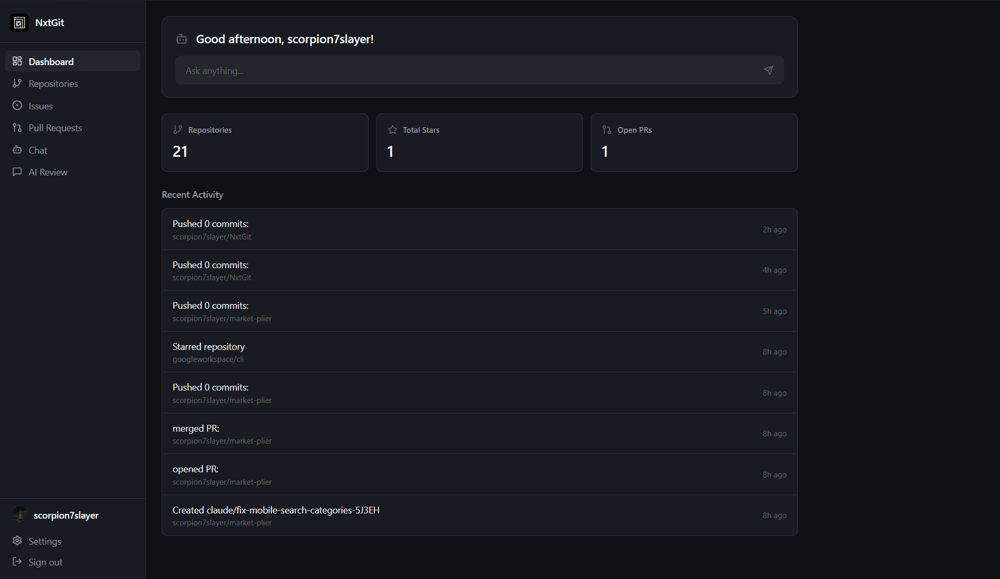

# NxtGit

AI-native Git client built with Tauri v2 — Liquid Glass UI, multi-provider AI chat, and full GitHub integration.



## Features

- **AI Chat** — Full conversational chat with streaming, thinking blocks, file & repo attachments
- **Extended Thinking** — See the AI's reasoning process in real-time (Anthropic, DeepSeek, OpenAI o-series, Ollama)
- **8 AI Providers** — GitHub Copilot, OpenRouter, Anthropic, OpenAI, Ollama (local & cloud), Moonshot, Kilocode, MiniMax
- **Smart Code Review** — AI-powered code reviews with streaming markdown output
- **In-App File Editor** — Edit files, commit & push directly from the app (like github.com)
- **Image Preview** — View images (PNG, JPG, GIF, SVG, WebP) inline in the file browser
- **Markdown Preview** — Toggle between code and rendered markdown preview
- **Commit & Push** — Create, edit, and delete files with commit messages — no terminal needed
- **Branch Management** — Switch branches, view protection status, create new branches
- **Repository Browser** — Browse repos, issues, PRs, commits, releases, contributors, and file trees
- **GitHub Actions** — View workflow runs, jobs, and step details
- **GitHub Changelog** — Read GitHub's changelog with full content, images, and videos in-app
- **Global Search** — Search repositories and users across GitHub
- **User Profiles** — View user profiles with repos, stats, and social links
- **Liquid Glass UI** — Light/dark mode with transparency, blur effects, and CSS custom properties
- **GitHub OAuth** — Device flow authentication for GitHub + separate Copilot OAuth
- **Persistent Chat** — Conversations saved locally, window state remembered across sessions
- **Ollama Support** — Local models with configurable URL, or Ollama Cloud with API key

## Downloads

| Platform | Architecture | Format |
| -------- | ------------ | ------ |
| **macOS** | Apple Silicon (M1+)/Intel (x86_64) | `.dmg` |
| **Windows** | x64 | `.msi` / `.exe` |
| **Windows** | x86 (32-bit) | `.msi` / `.exe` |
| **Windows** | ARM64 | `.exe` |
| **Linux** | x64 | `.deb` / `.AppImage` |
| **Linux** | ARM64 | `.deb` / `.AppImage` |

Download the latest release from the [Releases page](https://github.com/scorpion7slayer/NxtGit/releases).

## Latest Release Notes

### v1.0.1

- Fixed macOS window dragging
- Added in-app update notification and install flow
- Improved updater error feedback in the app

## Tech Stack

| Layer | Technology |
| ----- | ---------- |
| **Frontend** | React 18 + TypeScript + Tailwind CSS 3 + Vite 5 |
| **Backend** | Rust (Tauri v2) |
| **State** | Zustand v4 + Tauri Store (persistent) |
| **AI Streaming** | Direct SSE/NDJSON via ReadableStream |
| **Markdown** | react-markdown + remark-gfm + react-syntax-highlighter |
| **Design** | Liquid Glass (CSS custom properties, light/dark auto) |

## AI Providers

| Provider | Thinking Support | Auth |
| -------- | --------------- | ---- |
| **GitHub Copilot** | o-series `reasoning_content` | OAuth device flow |
| **OpenRouter** | `reasoning_details` + `reasoning` budget | API key |
| **Anthropic** | Extended thinking (`thinking` blocks) | API key |
| **OpenAI** | `reasoning_effort` for o1/o3/o4 | API key |
| **Ollama** | `think: true` (native NDJSON) | Optional (cloud) |
| **Moonshot** | `<think>` tags | API key |
| **Kilocode** | — | API key |
| **MiniMax** | — | API key |

## Getting Started

### Prerequisites

- Windows 10+ / macOS 14+ / Linux (Ubuntu 22.04+)
- Node.js 18+
- Rust toolchain (edition 2021, 1.77.2+)

### Installation

```bash
git clone https://github.com/scorpion7slayer/NxtGit.git
cd NxtGit

npm install          # Install frontend dependencies
npm run tauri-dev    # Dev mode: Vite + Tauri Rust backend
npm run tauri-build  # Production build
```

### Configuration

**GitHub OAuth** — Create a GitHub OAuth App with Device Flow enabled:

1. Go to [GitHub Developer Settings](https://github.com/settings/developers)
2. Create a new OAuth App, enable Device Flow
3. Set `VITE_GITHUB_CLIENT_ID` in your `.env`

**AI Providers** — Configure in Settings:

- API keys are stored locally via Tauri Store (never shared)
- GitHub Copilot uses a separate OAuth device flow
- Ollama works locally without a key; add one for Ollama Cloud

## Usage

1. **Login** — Authenticate with GitHub via device flow
2. **Browse** — Explore repositories, files, issues, and pull requests
3. **Edit** — Click Edit on any file, modify it, and commit directly
4. **Preview** — Toggle markdown preview, view images inline
5. **Chat** — Open AI Chat, pick a provider/model, start a conversation
6. **Review** — Paste code in AI Review for streaming code analysis
7. **Search** — Find repositories and users with Global Search

## Architecture

```text
NxtGit/
├── src/                        # React frontend
│   ├── components/             # UI components (Chat, Dashboard, RepoDetail, ...)
│   ├── stores/                 # Zustand stores (auth, persisted via Tauri Store)
│   └── lib/
│       ├── ai.ts               # AI providers, streaming, thinking, Copilot OAuth
│       └── github.ts           # GitHub API client (repos, PRs, issues, file CRUD)
├── src-tauri/                  # Rust backend
│   ├── src/lib.rs              # Plugin registration (http, shell, store, window-state)
│   ├── tauri.conf.json         # Window config, CSP, bundle targets
│   └── capabilities/           # Permission allowlists (HTTP domains, plugins)
├── .github/workflows/          # CI/CD
│   ├── release.yml             # Multi-platform release (macOS/Windows/Linux)
│   └── build.yml               # Reusable build workflow
└── package.json
```

## Security

- CSP restricted to whitelisted API domains
- HTTP permissions via Tauri capability allowlists
- OAuth `verification_uri` validated before opening
- Ollama URL validated (http/https only) to prevent SSRF
- Tokens stored via Tauri Store (OS-level secure storage), not localStorage
- HTML content sanitized with DOMPurify

## Contributing

Built for [Flavortown](https://flavortown.hackclub.com/) — a Hack Club program for high schoolers.

1. Fork the repository
2. Create a feature branch (`git checkout -b feature/amazing-feature`)
3. Commit your changes (`git commit -m 'Add amazing feature'`)
4. Push to the branch (`git push origin feature/amazing-feature`)
5. Open a Pull Request

## License

MIT License — see [LICENSE](LICENSE)

---

Built with love by @scorpion7slayer

